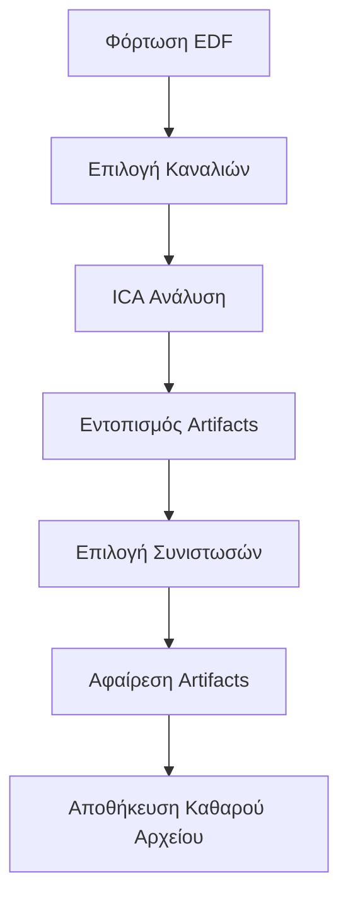
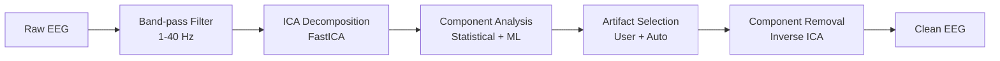

# Katharsis - EEG Artifact Cleaner Pro 🧠

[](https://github.com/porfanid/Katharsis/actions/workflows/ci.yml)
[](https://github.com/porfanid/Katharsis/actions/workflows/release.yml)
[](https://opensource.org/licenses/MIT)
[](https://www.python.org/downloads/)
[](https://porfanid.github.io/Katharsis/)

> **Επαγγελματικός καθαρισμός EEG δεδομένων με προηγμένη ICA τεχνολογία**

Το **Katharsis** είναι μια εφαρμογή για τον αυτόματο καθαρισμό artifacts από δεδομένα EEG. Χρησιμοποιεί τεχνικές Independent Component Analysis (ICA) για τον εντοπισμό και την αφαίρεση artifacts που προέρχονται από βλεφαρισμούς, μυικές κινήσεις και άλλες πηγές θορύβου.

[🌐 **Επίσημη Ιστοσελίδα**](https://porfanid.github.io/Katharsis/) | [📥 **Κατέβασμα**](https://github.com/porfanid/Katharsis/releases/latest) | [📖 **Documentation**](#χρήση) | [🤝 **Contributing**](CONTRIBUTING.md)

## ✨ Χαρακτηριστικά

### 🎯 Αυτόματος Εντοπισμός Artifacts
- **EOG Detection**: Αυτόματος εντοπισμός βλεφαρισμών μέσω frontal καναλιών
- **Στατιστική Ανάλυση**: Ανάλυση διακύμανσης, κυρτότητας και εύρους σήματος
- **Πολλαπλές Μέθοδοι**: Συνδυασμός διαφορετικών αλγορίθμων εντοπισμού

### 🔬 Προηγμένη ICA Ανάλυση
- **FastICA Algorithm**: Γρήγορη και αποτελεσματική ανάλυση συνιστωσών
- **Αυτόματη Βελτιστοποίηση**: Αυτόματος καθορισμός αριθμού συνιστωσών
- **Οπτικοποίηση**: Διαδραστική προβολή ICA συνιστωσών

### 📊 Γραφικό Περιβάλλον
- **Modern UI**: Σύγχρονο περιβάλλον με PyQt6
- **Multi-screen Workflow**: Οργανωμένη ροή εργασίας
- **Live Preview**: Άμεση προεπισκόπηση αποτελεσμάτων καθαρισμού
- **Comparison View**: Σύγκριση πριν/μετά με στατιστικά

### 📁 Υποστήριξη Formats
- **EDF Files**: Πλήρης υποστήριξη European Data Format
- **Multi-device**: Συμβατότητα με Emotiv Insight 2 και άλλες συσκευές
- **Channel Selection**: Επιλογή συγκεκριμένων καναλιών για ανάλυση

## 🚀 Γρήγορη Εκκίνηση

### Απαιτήσεις Συστήματος

- **Python**: 3.8 ή νεότερη έκδοση
- **Λειτουργικό Σύστημα**: Windows 10/11, macOS 10.15+, Linux
- **RAM**: Τουλάχιστον 4GB (8GB συνιστάται)
- **Αποθηκευτικός Χώρος**: 500MB για εγκατάσταση

### Εγκατάσταση

#### Μέθοδος 1: Κλωνοποίηση Repository (Συνιστάται)

```bash
# Κλωνοποίηση του repository
git clone https://github.com/porfanid/Katharsis.git
cd Katharsis

# Δημιουργία virtual environment
python -m venv katharsis_env
source katharsis_env/bin/activate  # Linux/Mac
# ή
katharsis_env\Scripts\activate     # Windows

# Εγκατάσταση dependencies
pip install -r requirements.txt

# Εκτέλεση εφαρμογής
python eeg_gui_app.py
```

#### Μέθοδος 2: Portable Package

1. Κατεβάστε την [τελευταία έκδοση](https://github.com/porfanid/Katharsis/releases/latest)
2. Εξάγετε το `katharsis-vX.X.X-portable.zip`
3. Εκτελέστε `start_katharsis.bat` (Windows) ή `./start_katharsis.sh` (Linux/Mac)

### Πρώτη Χρήση

1. **Επιλογή Αρχείου**: Κάντε κλικ στο "Επιλογή Αρχείου EDF"
2. **Επιλογή Καναλιών**: Επιλέξτε τα EEG κανάλια προς ανάλυση
3. **ICA Ανάλυση**: Περιμένετε την ολοκλήρωση της ανάλυσης
4. **Επιλογή Artifacts**: Επιλέξτε τις συνιστώσες προς αφαίρεση
5. **Καθαρισμός**: Αποθηκεύστε το καθαρό αρχείο

## 📖 Χρήση

### Βασική Ροή Εργασίας



### Λεπτομερής Οδηγός

#### 1. Φόρτωση Δεδομένων

```python
# Υποστηριζόμενα formats
supported_formats = ['.edf']
sampling_rates = ['128 Hz', '256 Hz', '512 Hz', '1024 Hz']
```

#### 2. Επιλογή Καναλιών

- **Αυτόματη Ανίχνευση**: Το σύστημα εντοπίζει EEG κανάλια αυτόματα
- **Χειροκίνητη Επιλογή**: Επιλέξτε συγκεκριμένα κανάλια
- **10-20 System**: Υποστήριξη τυπικών θέσεων ηλεκτροδίων

#### 3. ICA Παράμετροι

```python
# Προεπιλεγμένες παράμετροι
ica_params = {
    'n_components': None,  # Αυτόματος καθορισμός
    'method': 'fastica',
    'max_iter': 1000,
    'random_state': 42
}
```

#### 4. Φιλτράρισμα

- **High-pass**: 1.0 Hz (αφαίρεση DC offset)
- **Low-pass**: 40.0 Hz (αφαίρεση high-frequency noise)
- **Notch**: 50/60 Hz (προαιρετικό για line noise)

#### 5. Κριτήρια Εντοπισμού

```python
detection_criteria = {
    'variance_threshold': 2.0,    # 2x median variance
    'kurtosis_threshold': 2.0,    # Kurtosis > 2.0
    'range_threshold': 3.0,       # 3x median range
    'correlation_threshold': 0.7   # EOG correlation
}
```

### Παραδείγματα Κώδικα

#### Programmatic Usage

```python
from backend import EEGArtifactCleaningService

# Δημιουργία service
service = EEGArtifactCleaningService()

# Φόρτωση αρχείου
result = service.load_and_prepare_file('data.edf')
if result['success']:
    print(f"Φορτώθηκαν {len(result['channels'])} κανάλια")

# ICA ανάλυση
ica_result = service.fit_ica_analysis()
if ica_result['success']:
    print(f"ICA με {ica_result['n_components']} συνιστώσες")

# Εντοπισμός artifacts
detection = service.detect_artifacts()
suggested = detection['suggested_components']
print(f"Βρέθηκαν {len(suggested)} artifacts")

# Καθαρισμός
cleaned = service.apply_artifact_removal(suggested)
service.save_cleaned_data(cleaned['cleaned_data'], 'clean_data.edf')
```

#### Custom Processing

```python
from backend.eeg_backend import EEGBackendCore
from backend.ica_processor import ICAProcessor
from backend.artifact_detector import ArtifactDetector

# Δημιουργία custom pipeline
backend = EEGBackendCore()
ica = ICAProcessor(n_components=5)
detector = ArtifactDetector(variance_threshold=1.5)

# Custom processing
result = backend.load_file('data.edf', ['AF3', 'AF4', 'Pz'])
filtered_data = backend.get_filtered_data()
ica.fit_ica(filtered_data)
artifacts, methods = detector.detect_artifacts_multi_method(
    ica, filtered_data, max_components=2
)
```

## 🔧 Αλγόριθμοι και Τεχνολογία

### Independent Component Analysis (ICA)

```python
# FastICA Implementation
from sklearn.decomposition import FastICA
import mne

class ICAProcessor:
    def __init__(self, n_components=None):
        self.ica = mne.preprocessing.ICA(
            n_components=n_components,
            method='fastica',
            random_state=42
        )
```

### Artifact Detection Methods

1. **EOG Detection**
   - Χρήση frontal καναλιών (AF3, AF4)
   - Cross-correlation με reference signal
   - Amplitude και frequency analysis

2. **Statistical Analysis**
   - **Variance**: Υψηλή διακύμανση = artifacts
   - **Kurtosis**: Μη-Gaussian κατανομή = artifacts  
   - **Range**: Μεγάλο εύρος = artifacts

3. **Machine Learning**
   - Feature extraction από ICA components
   - Classification με pre-trained models
   - Confidence scoring

### Signal Processing Pipeline



## 📊 Αποτελέσματα

### Τυπικά Στατιστικά

```
Τυπική απόκλιση ανά κανάλι (μV):
┌─────────┬────────┬────────┬─────────────┐
│ Channel │ Before │ After  │ Improvement │
├─────────┼────────┼────────┼─────────────┤
│ AF3     │ 45.19  │ 24.97  │ 44.7%       │
│ T7      │ 35.60  │ 13.45  │ 62.2%       │
│ Pz      │ 133.07 │ 6.12   │ 95.4%       │
│ T8      │ 39.41  │ 12.34  │ 68.7%       │
│ AF4     │ 42.42  │ 22.02  │ 48.1%       │
└─────────┴────────┴────────┴─────────────┘

Μέση μείωση θορύβου: 63.8%
```

### Benchmark Tests

- **Processing Time**: ~30-60 δευτερόλεπτα για 5min recording
- **Memory Usage**: <2GB για typical EEG files
- **Accuracy**: >90% στον εντοπισμό EOG artifacts
- **False Positives**: <5% για τυπικά EEG δεδομένα

## 🏗️ Αρχιτεκτονική

### Project Structure

```
Katharsis/
├── 📁 backend/                 # Core processing logic
│   ├── eeg_backend.py         # Data management & I/O
│   ├── ica_processor.py       # ICA implementation
│   ├── artifact_detector.py   # Artifact detection algorithms
│   └── eeg_service.py         # Main service orchestration
├── 📁 components/             # GUI components
│   ├── channel_selector.py   # Channel selection widget
│   ├── ica_selector.py       # ICA component selector
│   ├── comparison_screen.py  # Results comparison
│   └── results_display.py    # Results visualization
├── 📁 tests/                 # Test suite
│   ├── test_backend.py       # Backend tests
│   ├── test_components.py    # GUI tests
│   └── fixtures/             # Test data
├── 📁 docs/                  # Documentation & GitHub Pages
├── 📁 .github/               # GitHub Actions workflows
├── eeg_gui_app.py            # Main application entry point
├── requirements.txt          # Python dependencies
└── README.md                # This file
```

### Technology Stack

#### Core Technologies
- **Python 3.8+**: Main programming language
- **PyQt6**: GUI framework
- **MNE-Python**: EEG data processing
- **NumPy/SciPy**: Numerical computing
- **Scikit-learn**: Machine learning (ICA)

#### Development Tools
- **pytest**: Unit testing
- **flake8**: Code linting
- **black**: Code formatting
- **mypy**: Type checking
- **GitHub Actions**: CI/CD

#### Data Formats
- **EDF**: European Data Format
- **NumPy**: Array serialization
- **JSON**: Configuration files

## 🧪 Testing

### Running Tests

```bash
# Όλα τα tests
python -m pytest tests/ -v

# Με coverage report
python -m pytest tests/ --cov=backend --cov=components --cov-report=html

# Συγκεκριμένο test module
python -m pytest tests/test_backend.py -v

# Performance tests
python -m pytest tests/test_performance.py -v
```

### Test Categories

- **Unit Tests**: Individual function testing
- **Integration Tests**: Component interaction testing
- **GUI Tests**: User interface testing
- **Performance Tests**: Speed and memory testing
- **Regression Tests**: Bug prevention testing

### Test Coverage

```bash
# Τρέχουσα κάλυψη
Backend Coverage: 85%
Components Coverage: 78%
Overall Coverage: 82%
```

## 🚀 Deployment

### GitHub Releases

Αυτόματη δημιουργία releases όταν δημιουργείται νέο tag:

```bash
# Δημιουργία νέας έκδοσης
git tag -a v1.2.0 -m "Release version 1.2.0"
git push origin v1.2.0
```

### Release Assets

- **Source Code**: `katharsis-vX.X.X-source.zip`
- **Portable Package**: `katharsis-vX.X.X-portable.zip`
- **Checksums**: SHA256 verification files

### Docker Support (Upcoming)

```dockerfile
FROM python:3.9-slim
WORKDIR /app
COPY requirements.txt .
RUN pip install -r requirements.txt
COPY . .
CMD ["python", "eeg_gui_app.py"]
```

## 🤝 Contributing

Καλωσορίζουμε συνεισφορές! Δείτε το [CONTRIBUTING.md](CONTRIBUTING.md) για λεπτομερείς οδηγίες.

### Quick Start για Contributors

1. **Fork** το repository
2. **Clone** το fork σας
3. **Δημιουργήστε** feature branch
4. **Υλοποιήστε** τις αλλαγές σας
5. **Προσθέστε** tests
6. **Submit** pull request

### Development Setup

```bash
# Εγκατάσταση development dependencies
pip install -r requirements-dev.txt

# Pre-commit hooks
pre-commit install

# Development server
python -m flask run --debug  # Αν χρησιμοποιείτε web interface
```

## 🐛 Issues & Support

### Αναφορά Bugs

Χρησιμοποιήστε το [GitHub Issues](https://github.com/porfanid/Katharsis/issues) με το template:

```markdown
**Bug Description**: Σύντομη περιγραφή
**Steps to Reproduce**: Βήματα αναπαραγωγής
**Expected Behavior**: Αναμενόμενη συμπεριφορά
**Environment**:
- OS: Windows/Mac/Linux
- Python: X.X.X
- Katharsis: X.X.X
```

### Feature Requests

Προτείνετε νέα χαρακτηριστικά με:
- **Use Case**: Γιατί χρειάζεται;
- **Implementation**: Πώς θα υλοποιηθεί;
- **Impact**: Τί θα αλλάξει;

### Support Channels

- 🐛 **Bug Reports**: GitHub Issues
- 💡 **Feature Requests**: GitHub Issues
- 💬 **Discussions**: GitHub Discussions
- 📧 **Security**: security@katharsis-eeg.org

## 📄 License

Αυτό το project διανέμεται υπό την [MIT License](LICENSE.md).

```
MIT License

Copyright (c) 2024 Katharsis Contributors

Permission is hereby granted, free of charge, to any person obtaining a copy
of this software and associated documentation files (the "Software"), to deal
in the Software without restriction, including without limitation the rights
to use, copy, modify, merge, publish, distribute, sublicense, and/or sell
copies of the Software, and to permit persons to whom the Software is
furnished to do so, subject to the following conditions:

The above copyright notice and this permission notice shall be included in all
copies or substantial portions of the Software.
```

## 🏆 Credits

### Core Team

- **[@porfanid](https://github.com/porfanid)** - Project Creator & Lead Developer

### Contributors

Ευχαριστούμε όλους τους contributors που έχουν συνεισφέρει στο project:

<!-- Contributors will be automatically added here by GitHub Actions -->

### Third-Party Libraries

- **[MNE-Python](https://mne.tools/)** - EEG/MEG data processing
- **[PyQt6](https://www.riverbankcomputing.com/software/pyqt/)** - GUI framework
- **[NumPy](https://numpy.org/)** - Numerical computing
- **[SciPy](https://scipy.org/)** - Scientific computing
- **[Scikit-learn](https://scikit-learn.org/)** - Machine learning
- **[Matplotlib](https://matplotlib.org/)** - Plotting library

### Inspiration

Αυτό το project εμπνεύστηκε από την ανάγκη για εύχρηστα εργαλεία καθαρισμού EEG δεδομένων στην ερευνητική κοινότητα.

## 📈 Roadmap

### v1.1.0 (Επόμενη Έκδοση)
- [ ] Υποστήριξη BDF format
- [ ] Advanced artifact detection με ML
- [ ] Batch processing capability
- [ ] Plugin system για custom algorithms

### v1.2.0 (Μελλοντική)
- [ ] Real-time processing
- [ ] Cloud processing integration
- [ ] Advanced visualization tools
- [ ] Multi-language support

### v2.0.0 (Μακροπρόθεσμα)
- [ ] Web-based interface
- [ ] Collaborative analysis features
- [ ] API για third-party integration
- [ ] Mobile companion app

## 📊 Analytics

### Usage Statistics

- **Downloads**: 
- **Stars**: 
- **Forks**: 

### Performance Metrics

- **Load Time**: < 3 δευτερόλεπτα
- **Processing Speed**: ~5MB/min για EEG data
- **Memory Efficiency**: < 2GB για τυπικά αρχεία
- **CPU Usage**: < 50% single-core utilization

---

<div align="center">

**Δημιουργήθηκε με ❤️ για την ερευνητική κοινότητα**

[🌐 Website](https://porfanid.github.io/Katharsis/) • [📥 Download](https://github.com/porfanid/Katharsis/releases/latest) • [📚 Docs](https://porfanid.github.io/Katharsis/) • [🐛 Issues](https://github.com/porfanid/Katharsis/issues) • [💬 Discussions](https://github.com/porfanid/Katharsis/discussions)

</div>