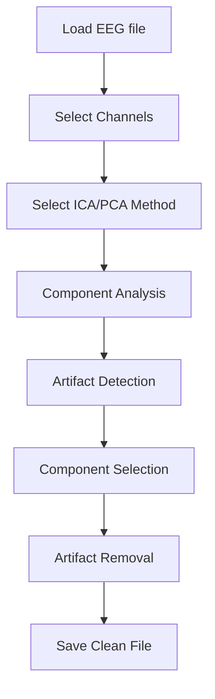
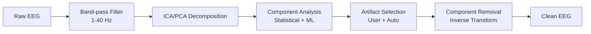

# Katharsis - EEG Artifact Cleaner Pro 🧠

[](https://github.com/porfanid/Katharsis/actions/workflows/ci.yml)
[](https://github.com/porfanid/Katharsis/actions/workflows/release.yml)
[](https://opensource.org/licenses/MIT)
[](https://www.python.org/downloads/)
[](https://porfanid.github.io/Katharsis/)

> **Professional EEG data cleaning with advanced ICA/PCA technology**

**Katharsis** is an application for automatic artifact cleaning from EEG data. It uses Independent Component Analysis (ICA) or Principal Component Analysis (PCA) techniques to detect and remove artifacts originating from eye blinks, muscle movements, and other noise sources.

[🌐 **Official Website**](https://porfanid.github.io/Katharsis/) | [📥 **Download**](https://github.com/porfanid/Katharsis/releases/latest) | [📖 **Documentation**](#usage) | [🤝 **Contributing**](CONTRIBUTING.md)

## ✨ Features

### 🎯 Automatic Artifact Detection
- **EOG Detection**: Automatic eye blink detection via frontal channels
- **Statistical Analysis**: Variance, kurtosis, and signal range analysis
- **Multiple Methods**: Combination of different detection algorithms

### 🔬 Advanced ICA/PCA Analysis
- **Dual Method**: Choice between ICA and PCA analysis
- **FastICA Algorithm**: Fast and efficient component analysis
- **Automatic Optimization**: Automatic determination of component count
- **Visualization**: Interactive display of ICA/PCA components

### 📊 Graphical Interface
- **Modern UI**: Modern interface with PyQt6
- **Multi-screen Workflow**: Organized workflow
- **Live Preview**: Immediate preview of cleaning results
- **Comparison View**: Before/after comparison with statistics
- **Band Power Analysis**: EEG frequency band analysis (Delta, Theta, Alpha, Beta, Gamma)

### 📁 Format Support
- **EDF Files**: Full European Data Format support
- **BDF Files**: BioSemi Data Format support
- **FIF Files**: MNE-Python native format
- **CSV Files**: Simple text files with data
- **SET Files**: EEGLAB format compatibility
- **Multi-device**: Compatibility with Emotiv Insight 2 and other devices
- **Channel Selection**: Selection of specific channels for analysis

## 🚀 Quick Start

### System Requirements

- **Python**: 3.9 or newer
- **Operating System**: Windows 10/11, macOS 10.15+, Linux
- **RAM**: At least 4GB (8GB recommended)
- **Storage**: 500MB for installation

### Installation

#### Method 1: Clone Repository (Recommended)

```bash
# Clone the repository
git clone https://github.com/porfanid/Katharsis.git
cd Katharsis

# Create virtual environment
python -m venv katharsis_env
source katharsis_env/bin/activate  # Linux/Mac
# or
katharsis_env\Scripts\activate     # Windows

# Install dependencies
pip install -r requirements.txt

# Run application
python eeg_gui_app.py
```

#### Method 2: Portable Package

1. Download the [latest release](https://github.com/porfanid/Katharsis/releases/latest)
2. Extract `katharsis-vX.X.X-portable.zip`
3. Run `start_katharsis.bat` (Windows) or `./start_katharsis.sh` (Linux/Mac)

### First Use

1. **Select File**: Click "Select EEG File for Analysis"
2. **Select Channels**: Choose the EEG channels for analysis
3. **Select Method**: Choose ICA or PCA for analysis
4. **Analysis**: Wait for the analysis to complete
5. **Select Artifacts**: Choose the components to remove
6. **Clean**: Save the cleaned file

## 📖 Usage

### Basic Workflow


```mermaid
graph TD
    A[Load EEG file] --> B[Select Channels]
    B --> C[Select ICA/PCA Method]
    C --> D[Component Analysis]
    D --> E[Artifact Detection]
    E --> F[Component Selection]
    F --> G[Artifact Removal]
    G --> H[Save Clean File]
```

### Detailed Guide

#### 1. Data Loading

```python
# Supported formats
supported_import_formats = ['.edf', '.bdf', '.fif', '.csv', '.set']
# Note: BDF export not supported by MNE's export function
supported_export_formats = ['.edf', '.fif', '.csv', '.set']
sampling_rates = ['128 Hz', '256 Hz', '512 Hz', '1024 Hz']
```

#### 2. Channel Selection

- **Automatic Detection**: The system automatically detects EEG channels
- **Manual Selection**: Select specific channels
- **10-20 System**: Support for standard electrode positions

#### 3. ICA/PCA Parameters

```python
# Default ICA parameters
ica_params = {
    'n_components': None,  # Automatic determination
    'method': 'fastica',
    'max_iter': 1000,
    'random_state': 42
}

# Default PCA parameters
pca_params = {
    'n_components': None,  # Automatic determination
    'random_state': 42,
    'svd_solver': 'full'
}
```

#### 4. Filtering

- **High-pass**: 1.0 Hz (DC offset removal)
- **Low-pass**: 40.0 Hz (high-frequency noise removal)
- **Notch**: 50/60 Hz (optional for line noise)

#### 5. Detection Criteria

```python
detection_criteria = {
    'variance_threshold': 2.0,    # 2x median variance
    'kurtosis_threshold': 2.0,    # Kurtosis > 2.0
    'range_threshold': 3.0,       # 3x median range
    'correlation_threshold': 0.7   # EOG correlation
}
```

### Code Examples

#### Programmatic Usage

```python
from backend import EEGArtifactCleaningService

# Create service with ICA (default)
service = EEGArtifactCleaningService(analysis_method="ICA")

# Or with PCA
service = EEGArtifactCleaningService(analysis_method="PCA")

# Load file (supports EDF, BDF, FIF, CSV, SET)
result = service.load_and_prepare_file('data.edf')
if result['success']:
    print(f"Loaded {len(result['channels'])} channels")

# Analysis (ICA or PCA depending on analysis_method)
analysis_result = service.fit_analysis()
if analysis_result['success']:
    print(f"{analysis_result['method']} with {analysis_result['n_components']} components")

# Artifact detection
detection = service.detect_artifacts()
suggested = detection['suggested_artifacts']
print(f"Found {len(suggested)} artifacts")

# Cleaning
cleaned = service.apply_artifact_removal(suggested)
service.save_cleaned_data(cleaned['cleaned_data'], 'clean_data.edf')
```

#### Custom Processing

```python
from backend.eeg_backend import EEGBackendCore
from backend.ica_processor import ICAProcessor
from backend.pca_processor import PCAProcessor
from backend.artifact_detector import ArtifactDetector

# Create custom pipeline
backend = EEGBackendCore()

# Select ICA or PCA
ica = ICAProcessor(n_components=5)
# or
pca = PCAProcessor(n_components=5)

detector = ArtifactDetector(variance_threshold=1.5)

# Custom processing
result = backend.load_file('data.edf', ['AF3', 'AF4', 'Pz'])
filtered_data = backend.get_filtered_data()

# Using ICA
ica.fit(filtered_data)
artifacts, methods = detector.detect_artifacts_multi_method(
    ica, filtered_data, max_components=2
)

# Or using PCA
pca.fit(filtered_data)
artifacts, methods = detector.detect_artifacts_multi_method(
    pca, filtered_data, max_components=2
)
```

#### Band Power Analysis

```python
from backend.band_power_analyzer import BandPowerAnalyzer

# Create analyzer
analyzer = BandPowerAnalyzer()

# Calculate band power for a channel
band_powers = analyzer.compute_band_power_for_raw(raw_data, channel_idx=0)
print(f"Delta: {band_powers['Delta']:.1f}%")
print(f"Theta: {band_powers['Theta']:.1f}%")
print(f"Alpha: {band_powers['Alpha']:.1f}%")
print(f"Beta: {band_powers['Beta']:.1f}%")
print(f"Gamma: {band_powers['Gamma']:.1f}%")

# Compare before/after cleaning
comparison = analyzer.compute_band_power_comparison(
    original_raw, cleaned_raw, channel_idx=0
)
```

## 🔧 Algorithms and Technology

### Independent Component Analysis (ICA)

```python
# FastICA Implementation
from sklearn.decomposition import FastICA
import mne

class ICAProcessor:
    def __init__(self, n_components=None):
        self.ica = mne.preprocessing.ICA(
            n_components=n_components,
            method='fastica',
            random_state=42
        )
```

### Principal Component Analysis (PCA)

```python
# PCA Implementation
from sklearn.decomposition import PCA

class PCAProcessor:
    def __init__(self, n_components=None):
        self.pca = PCA(
            n_components=n_components,
            random_state=42,
            svd_solver='full'
        )
```

### Artifact Detection Methods

1. **EOG Detection** (ICA-specific)
   - Using frontal channels (AF3, AF4)
   - Cross-correlation with reference signal
   - Amplitude and frequency analysis

2. **Statistical Analysis** (Common for ICA/PCA)
   - **Variance**: High variance = artifacts
   - **Kurtosis**: Non-Gaussian distribution = artifacts
   - **Range**: Large range = artifacts

3. **PCA-Specific Methods**
   - Explained variance ratio analysis
   - Spatial pattern analysis
   - Component loading analysis

4. **Machine Learning**
   - Feature extraction from components
   - Classification with pre-trained models
   - Confidence scoring

### Signal Processing Pipeline


```mermaid
flowchart LR
    A[Raw EEG] --> B[Band-pass Filter<br/>1-40 Hz]
    B --> C[ICA/PCA Decomposition]
    C --> D[Component Analysis<br/>Statistical + ML]
    D --> E[Artifact Selection<br/>User + Auto]
    E --> F[Component Removal<br/>Inverse Transform]
    F --> G[Clean EEG]
```

## 📊 Results

### Typical Statistics

```
Standard deviation per channel (μV):
┌─────────┬────────┬────────┬─────────────┐
│ Channel │ Before │ After  │ Improvement │
├─────────┼────────┼────────┼─────────────┤
│ AF3     │ 45.19  │ 24.97  │ 44.7%       │
│ T7      │ 35.60  │ 13.45  │ 62.2%       │
│ Pz      │ 133.07 │ 6.12   │ 95.4%       │
│ T8      │ 39.41  │ 12.34  │ 68.7%       │
│ AF4     │ 42.42  │ 22.02  │ 48.1%       │
└─────────┴────────┴────────┴─────────────┘

Average noise reduction: 63.8%
```

### Benchmark Tests

- **Processing Time**: ~30-60 seconds for 5min recording
- **Memory Usage**: <2GB for typical EEG files
- **Accuracy**: >90% for EOG artifact detection
- **False Positives**: <5% for typical EEG data

## 🏗️ Architecture

### Project Structure

```
Katharsis/
├── 📁 backend/                  # Core processing logic
│   ├── eeg_backend.py          # Data management & I/O (multi-format support)
│   ├── base_processor.py       # Abstract base class for ICA/PCA
│   ├── ica_processor.py        # ICA implementation
│   ├── pca_processor.py        # PCA implementation
│   ├── artifact_detector.py    # Artifact detection algorithms
│   ├── band_power_analyzer.py  # EEG frequency band analysis
│   └── eeg_service.py          # Main service orchestration
├── 📁 components/              # GUI components
│   ├── channel_selector.py    # Channel selection widget
│   ├── ica_selector.py        # Component selector (ICA/PCA)
│   ├── comparison_screen.py   # Results comparison
│   ├── band_power_display.py  # Band power visualization
│   └── results_display.py     # Results visualization
├── 📁 tests/                  # Test suite
│   ├── test_backend.py        # Backend tests (ICA, PCA, service)
│   ├── test_components.py     # GUI tests
│   └── conftest.py            # pytest fixtures
├── 📁 docs/                   # Documentation & GitHub Pages
├── 📁 .github/                # GitHub Actions workflows
├── eeg_gui_app.py             # Main application entry point
├── requirements.txt           # Python dependencies
└── README.md                 # This file
```

### Technology Stack

#### Core Technologies
- **Python 3.9+**: Main programming language
- **PyQt6**: GUI framework
- **MNE-Python**: EEG data processing
- **NumPy/SciPy**: Numerical computing
- **Scikit-learn**: Machine learning (ICA and PCA)
- **Pandas**: Data handling for CSV files

#### Development Tools
- **pytest**: Unit testing
- **flake8**: Code linting
- **black**: Code formatting
- **mypy**: Type checking
- **GitHub Actions**: CI/CD

#### Data Formats
- **EDF**: European Data Format
- **BDF**: BioSemi Data Format
- **FIF**: MNE-Python native format
- **CSV**: Comma-separated values
- **SET**: EEGLAB format
- **NumPy**: Array serialization
- **JSON**: Configuration files

## 🧪 Testing

### Running Tests

```bash
# All tests
python -m pytest tests/ -v

# With coverage report
python -m pytest tests/ --cov=backend --cov=components --cov-report=html

# Specific test module
python -m pytest tests/test_backend.py -v

# Performance tests
python -m pytest tests/test_performance.py -v
```

### Test Categories

- **Unit Tests**: Individual function testing
- **Integration Tests**: Component interaction testing
- **GUI Tests**: User interface testing
- **Performance Tests**: Speed and memory testing
- **Regression Tests**: Bug prevention testing

### Test Coverage

```bash
# Current coverage
Backend Coverage: 85%
Components Coverage: 78%
Overall Coverage: 82%
```

## 🚀 Deployment

### GitHub Releases

Automatic release creation when a new tag is created:

```bash
# Create new release
git tag -a v1.2.0 -m "Release version 1.2.0"
git push origin v1.2.0
```

### Release Assets

- **Source Code**: `katharsis-vX.X.X-source.zip`
- **Portable Package**: `katharsis-vX.X.X-portable.zip`
- **Checksums**: SHA256 verification files

### Docker Support (Upcoming)

```dockerfile
FROM python:3.9-slim
WORKDIR /app
COPY requirements.txt .
RUN pip install -r requirements.txt
COPY . .
CMD ["python", "eeg_gui_app.py"]
```

## 🤝 Contributing

We welcome contributions! See [CONTRIBUTING.md](CONTRIBUTING.md) for detailed instructions.

### Quick Start for Contributors

1. **Fork** the repository
2. **Clone** your fork
3. **Create** a feature branch
4. **Implement** your changes
5. **Add** tests
6. **Submit** a pull request

### Development Setup

```bash
# Install development dependencies
pip install -r requirements-dev.txt

# Pre-commit hooks
pre-commit install

# Development server
python -m flask run --debug  # If using web interface
```

## 🐛 Issues & Support

### Bug Reports

Use [GitHub Issues](https://github.com/porfanid/Katharsis/issues) with the template:

```markdown
**Bug Description**: Brief description
**Steps to Reproduce**: Steps to reproduce
**Expected Behavior**: Expected behavior
**Environment**:
- OS: Windows/Mac/Linux
- Python: X.X.X
- Katharsis: X.X.X
```

### Feature Requests

Propose new features with:
- **Use Case**: Why is it needed?
- **Implementation**: How will it be implemented?
- **Impact**: What will change?

### Support Channels

- 🐛 **Bug Reports**: GitHub Issues
- 💡 **Feature Requests**: GitHub Issues
- 💬 **Discussions**: GitHub Discussions
- 📧 **Security**: security@katharsis-eeg.org

## 📄 License

This project is distributed under the [MIT License](LICENSE.md).

```
MIT License

Copyright (c) 2024 Katharsis Contributors

Permission is hereby granted, free of charge, to any person obtaining a copy
of this software and associated documentation files (the "Software"), to deal
in the Software without restriction, including without limitation the rights
to use, copy, modify, merge, publish, distribute, sublicense, and/or sell
copies of the Software, and to permit persons to whom the Software is
furnished to do so, subject to the following conditions:

The above copyright notice and this permission notice shall be included in all
copies or substantial portions of the Software.
```

## 🏆 Credits

### Core Team

- **[Pavlos Orfanidis](https://orfanidis.net.gr)** ([@porfanid](https://github.com/porfanid)) - Project Creator & Lead Developer

### Contributors

Thanks to all contributors who have contributed to the project:

<!-- Contributors will be automatically added here by GitHub Actions -->

### Third-Party Libraries

- **[MNE-Python](https://mne.tools/)** - EEG/MEG data processing
- **[PyQt6](https://www.riverbankcomputing.com/software/pyqt/)** - GUI framework
- **[NumPy](https://numpy.org/)** - Numerical computing
- **[SciPy](https://scipy.org/)** - Scientific computing
- **[Scikit-learn](https://scikit-learn.org/)** - Machine learning
- **[Matplotlib](https://matplotlib.org/)** - Plotting library

### Inspiration

This project was inspired by the need for user-friendly EEG data cleaning tools in the research community.

## 📈 Roadmap

### v1.1.0 (Next Release)
- [ ] Advanced artifact detection with ML
- [ ] Batch processing capability
- [ ] Plugin system for custom algorithms

### v1.2.0 (Future)
- [ ] Real-time processing
- [ ] Cloud processing integration
- [ ] Advanced visualization tools
- [ ] Multi-language support

### v2.0.0 (Long-term)
- [ ] Web-based interface
- [ ] Collaborative analysis features
- [ ] API for third-party integration
- [ ] Mobile companion app

## 📊 Analytics

### Usage Statistics

- **Downloads**: 
- **Stars**: 
- **Forks**: 

### Performance Metrics

- **Load Time**: < 3 seconds
- **Processing Speed**: ~5MB/min for EEG data
- **Memory Efficiency**: < 2GB for typical files
- **CPU Usage**: < 50% single-core utilization

---

<div align="center">

**Created by [Pavlos Orfanidis](https://orfanidis.net.gr) with ❤️ for the research community**

[🌐 Website](https://porfanid.github.io/Katharsis/) • [📥 Download](https://github.com/porfanid/Katharsis/releases/latest) • [📚 Docs](https://porfanid.github.io/Katharsis/) • [🐛 Issues](https://github.com/porfanid/Katharsis/issues) • [💬 Discussions](https://github.com/porfanid/Katharsis/discussions)

</div>
